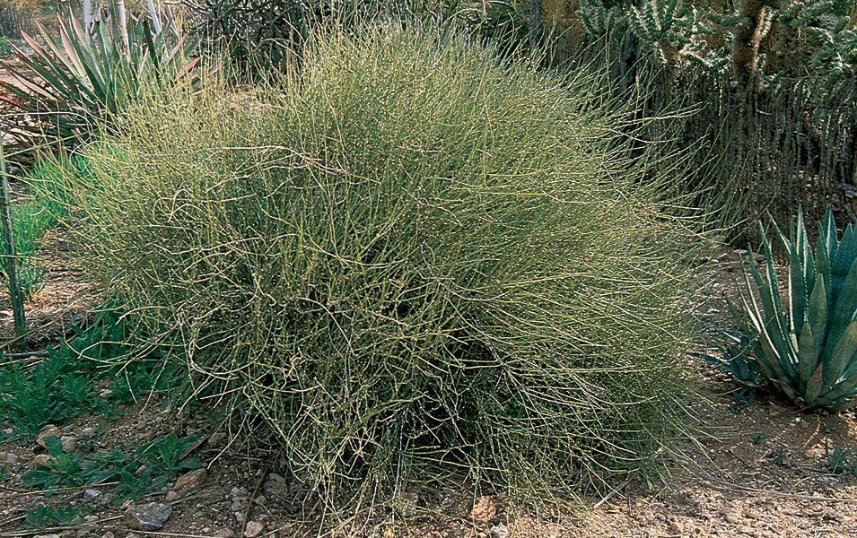

---
title:
author: "cjlortie"
date: "Dec 2016"
output:
  html_document:
    theme: spacelab
    toc: yes
    toc_depth: 3
    toc_float: yes
  pdf_document:
    toc: yes
---
#Ephedra californica recovery
###Purpose
To explore *Ephedra californica* recovery following clipping. Year two in a long-term shrub removal experiment. Aboveground clipping. Panoche Hills Ecological Reserve. The manipulative research was done at site 1.1, the plateau within this reserve.

Removal done by A. Liczner, A. Filazzola, T. Noble, and M. Westphal. Loss of shrub effects on animals experiment separate from this survey initiated by A. Liczner and completed 2016. Eva Gruber surveyed for resprouting.



[ecoblender](http://ecoblender.org)

```{r loads, warning=FALSE, message=FALSE, echo=FALSE}
library(tidyverse)

```

###Ephedra foundation effects
An examination of the evidence associated with pattern analyses between ephedra and other plant species at Panoche Hills Ecological Reserve.

```{r foundation, message=FALSE, warning=FALSE}
#Data
#Primary
foundation <- read_csv("data/ephedra.foundation.csv")
foundation <- foundation %>% mutate(volume = ((length + width)/2)^3*3.14*(1/3))
foundation$year <- as.character(foundation$year)
foundation$site <- as.character(foundation$site)
foundation

#Effect sizes
foundation.rii <- read_csv("data/ephedra.foundation.rii.csv")
foundation.rii <- foundation.rii %>% mutate(volume = ((length + width)/2)^3*3.14*(1/3))
foundation.rii$year <- as.character(foundation.rii$year)
foundation.rii$site <- as.character(foundation.rii$site)
foundation.rii <- foundation.rii %>% filter(abundance < 0.8 & abundance > -0.7)
foundation.rii

rii.2013 <- foundation.rii %>% filter(year == "2013")
rii.2014 <- foundation.rii %>% filter(year == "2014")
rii.2015 <- foundation.rii %>% filter(year == "2015")
rii.2016 <- foundation.rii %>% filter(year == "2016")

#Rii
#differences from open
ggplot(foundation.rii, aes(year, abundance)) + geom_boxplot(fill = "darkseagreen3") + ylab("Rii abundance")
ggplot(foundation.rii, aes(year,richness)) + geom_boxplot(fill = "darkseagreen3") + ylab("Rii richness")

#models for different between years
require(lmerTest)
m <- lmer(abundance~(1|year) + volume, data = foundation.rii)
#summary(m)
anova(m, test = "Chisq")
rand(m) #to get p-values for random effects


m <- lmer(richness~(1|year) + volume, data = foundation.rii)
#summary(m) 
anova(m, test = "Chisq")
rand(m)


#different from zero
#ab
t1 <- t.test(foundation.rii$abundance, mu = 0)
t1

#richness
t2 <- t.test(foundation.rii$richness, mu = 0)
t2

# ab each year
t1 <- t.test(rii.2013$abundance, mu = 0)
t1

t1 <- t.test(rii.2014$abundance, mu = 0)
t1

t1 <- t.test(rii.2015$abundance, mu = 0)
t1

t1 <- t.test(rii.2016$abundance, mu = 0)
t1

#richness by year
t2 <- t.test(rii.2013$richness, mu = 0)
t2

t2 <- t.test(rii.2014$richness, mu = 0)
t2

t2 <- t.test(rii.2015$richness, mu = 0)
t2

t2 <- t.test(rii.2016$richness, mu = 0)
t2


#volume####
ggplot(foundation.rii, aes(volume, abundance)) + geom_point(aes(color = year)) + geom_smooth(method = "lm") + xlab("volume (m^3)")

ggplot(foundation.rii, aes(volume, abundance, color = year)) + geom_point() + geom_smooth(method = "lm", se = FALSE) + xlab("volume (m^3)")

ggplot(foundation.rii, aes(volume, richness)) + geom_point(aes(color=year)) + geom_smooth(method = "lm") + xlab("volume (m^3)")

ggplot(foundation.rii, aes(volume, richness, color = year)) + geom_point() + geom_smooth(method = "lm", se = FALSE) + xlab("volume (m^3)")

#posthoc tests from main models
#abundance
m <- lm(abundance~volume, data = foundation.rii)
m
summary(m)

#Quantile regression check
require(quantreg)
m <- rq(abundance~volume, data = foundation.rii)
m
summary(m, se = "nid")
rho <- function(u,tau=.5)u*(tau - (u < 0))
V <- sum(rho(m$resid, m$tau))
V

#richness
m <- lm(richness~volume, data = foundation.rii)
m
summary(m)
#Quantile regression
m <- rq(richness~volume, data = foundation.rii)
m
summary(m, se = "nid")
V <- sum(rho(m$resid, m$tau))
V


#test 2016 only
#m <- lm(abundance~volume, data = rii.2016)
#m
#summary(m)

#m <- lm(richness~volume, data = rii.2016)
#m
#summary(m)

#Primary data
#ggplot(foundation, aes(microsite, abundance)) + geom_boxplot() + facet_grid(~year)
#ggplot(foundation, aes(microsite, richness)) + geom_boxplot() + facet_grid(~year)
#ggplot(foundation, aes(volume, abundance, color = year)) + geom_point() + geom_smooth(method = "lm")
#ggplot(foundation, aes(volume, richness, color = year)) + geom_point() + geom_smooth(method = "lm")

```

###Recovery data wrangling
```{r recovery data, message=FALSE, warning=FALSE}
#wrangle primary data
data <- read_csv("data/EH.recovery.2016.csv")
data <- data %>% mutate(volume = ((length + width)/2)^3*3.14*(1/3)) %>% arrange(desc(resprout))
data

#stem data####
wet.weights <-read.csv("data/wet.weights.csv")
total.weight <- wet.weights %>% select(ID, total.weight)
stems <- read_csv("data/stem.analyses.csv")

#current volume used####
nov.2016 <- data %>% filter(date == "nov.2016") #only resurvey
nov.2016 <- left_join(nov.2016, total.weight, by = "ID")

#setup volume####
setup <- data %>% filter(date == "april.2013") %>% 
  select(ID, volume) %>% rename(setup.vol = volume)

merged.data <- left_join(nov.2016, setup)
merged.data <- left_join(merged.data, stems, by = "ID")

```

###Recovery inference
```{r recovery models, message=FALSE, warning= FALSE}
#Recovery####
#Viz
#ggplot(nov.2016, aes(resprout, weight= volume)) + 
  #geom_histogram(binwidth = 2, fill = "darkseagreen3") +
  #xlab("number of shoots resprouted") +
  #ylab("relative weighted frequency by current volume") +
  #xlim(0,15)

ggplot(nov.2016, aes(resprout, weight= volume)) +
  geom_density(kernel = "gaussian", fill = "darkseagreen3") +
  xlab("number of shoots resprouted") +
  ylab("relative weighted frequency by current volume") +
  xlim(0,15)

ggplot(nov.2016, aes(height, weight= volume)) +
  geom_density(kernel = "gaussian", fill = "darkseagreen3") +
  xlab("height (m)") +
  ylab("relative weighted frequency by current volume")   

#ggplot(nov.2016, aes(total.weight, weight= volume)) + 
  #geom_histogram(binwidth = 700, fill = "darkseagreen3") +
  #xlab("total biomass (g)") +
  #ylab("relative weighted frequency by current volume")

ggplot(nov.2016, aes(total.weight, weight= volume)) +
  geom_density(kernel = "gaussian", fill = "darkseagreen3") +
  xlab("total biomass (g)") +
  ylab("relative weighted frequency by current volume") +
  xlim(0,5000)

summary(nov.2016)

```

###Shrub volume inference
```{r volume, warning=FALSE, message=FALSE}
#Size-dependent recoveries####
#Primary data
ggplot(merged.data, aes(setup.vol, resprout)) +
  geom_point(color = "darkseagreen3") +
  geom_smooth(method = "lm", color = "darkseagreen3") +
  xlab("initial shrub volume (m^3)") +
  ylab("number of shoots resprouted")

ggplot(merged.data, aes(setup.vol, total.weight)) +
  geom_point(color = "darkseagreen3") +
  geom_smooth(method = "lm", color = "darkseagreen3") +
  xlab("initial shrub volume (m^3)") +
  ylab("total biomass (g)")

#simple models
#shoots
fit <-lm(resprout ~ setup.vol, data = merged.data)
summary(fit)
plot(fit)

fit <-rq(resprout ~ setup.vol, data = merged.data)
summary(fit, se = "nid")

res <- resid(fit)
#plot(merged.data$resprout, res)
plot(merged.data$setup.vol, abs(res))

m <- glm(resprout ~ setup.vol, data = merged.data)
summary(m)
anova(m, test = "Chisq")

#biomass
fit <-lm(total.weight ~ setup.vol, data = merged.data)
summary(fit)
plot(fit)

#quantile
fit <-rq(total.weight ~ setup.vol, data = merged.data)
summary(fit, se = "nid")

m <- glm(total.weight ~ setup.vol, data = merged.data)
summary(m)
anova(m, test = "Chisq")


#Proportion regrowth by initial shrub size
#calculate proportion reprouting by initial size
#merged.data <-merged.data %>% mutate(relative.regrowth = resprout/setup.vol) 
#merged.data <-merged.data %>% mutate(relative.biomass.regrowth = total.weight/setup.vol) #calculate proportion reprouting by initial size

#ggplot(merged.data, aes(volume, relative.regrowth)) + geom_point(color = "darkseagreen3") + xlab("current shrub volume") + 
  #geom_smooth(method = lm, color = "darkseagreen3") +
  #ylab("regrowth weighted by initial shrub size") +
  #scale_y_continuous(breaks=c(-2,-1,0,1,2))

#ggplot(merged.data, aes(volume, relative.biomass.regrowth)) + geom_point(color = "darkseagreen3") + xlab("current shrub volume") + 
  #geom_smooth(method = lm, color = "darkseagreen3") +
  #ylab("biomass regrowth weighted by initial shrub size") +
  #scale_y_continuous(breaks=c(-2,-1,0,1,2))


#m3 <- lm(merged.data$relative.regrowth ~ merged.data$volume)
#summary(m3) # slope is not significantly different from 0 so no difference in proportionate regrowth
#anova(m3, test = "Chisq")

#m3.1 <- lm(merged.data$relative.biomass.regrowth ~ merged.data$volume)
#summary(m3.1) # slope is not significantly different from 0 so no difference in proportionate regrowth
#anova(m3.1, test = "Chisq")

```

###Biomass prediction
```{r stem analyses and dry weight, message=FALSE, warning=FALSE}

#number of resprouted shoots predict wet weight
ggplot(nov.2016, aes(resprout, total.weight)) + 
  geom_point(color = "seagreen3") + 
  xlab("resprouted shoot numbers") +
  ylab("total biomass (g)") +
  geom_smooth(method = lm, color = "seagreen3")

#quick test
fit <- lm(total.weight ~ resprout, data= nov.2016)
summary(fit)

fit <- rq(total.weight ~ resprout, data= nov.2016)
summary(fit, se = "nid")

ggplot(nov.2016, aes(volume, total.weight)) + 
  geom_point(color = "seagreen3") + 
  xlab("shrub volumes (m^3)") +
  ylab("total biomass (g)") +
  geom_smooth(method = lm, color = "seagreen3")

fit <- lm(total.weight ~ volume, data= nov.2016)
summary(fit)

fit <- rq(total.weight ~ volume, data= nov.2016)
summary(fit, se = "nid")

#Wet biomass predictor for dry weights
ggplot(merged.data, aes(total.weight, total.dry.weight.g)) + 
  geom_point(color = "seagreen3") + 
  xlab("total wet biomass (g)") +
  ylab("total dry weight (g)") +
  geom_smooth(method = "lm", color = "seagreen3")

fit <- lm(total.dry.weight.g ~ total.weight, data= merged.data)
summary(fit)

library(outliers)
chisq.out.test(merged.data$resprout)
chisq.out.test(merged.data$total.weight)
chisq.out.test(merged.data$total.dry.weight.g)

```

###Morphometrics
```{r morphometrics, warning=FALSE, message=FALSE}
ggplot(merged.data, aes(total.singletons, total.complex.green.shoots)) + geom_point(color = "seagreen3") +
  geom_smooth(method = lm, color = "seagreen3")

ggplot(merged.data, aes(total.singletons, total.woody.shoots)) + geom_point(color = "seagreen3") +
  geom_smooth(method = lm, color = "seagreen3")

ggplot(merged.data, aes(resprout, total.singletons)) + 
    geom_point(color = "seagreen3") +
    geom_smooth(method = lm, color = "seagreen3") +
  xlab("number of shoots resprouted") +
  ylab("total number of axillary singleton shoots")

fit <- lm(resprout~total.singletons, data= merged.data)
summary(fit)

chisq.out.test(merged.data$total.singletons)

ggplot(merged.data, aes(volume, total.singletons)) + 
    geom_point(color = "seagreen3") +
    geom_smooth(method = lm, color = "seagreen3")

```

###Summary
<b> Primary trends. </b>  

1. Counting resprouted shoots is an effective and relatively accurate mechanism to estimate regrowth in *Ephedra californica* following damage.  Trends in regrowth similar between shoot number and total wet weight, and shoot number significantly and effectively predicts the mass of biomass regrowth per shrub.


2. Larger shrubs have more resprouted shoots and regrowth of biomass; however, the regrowth is not proportionately greater for increasingly larger shrubs. THIS is an important finding.  Larger shrubs do NOT have a greater capacity to proportionally recover from damage relative to smaller shrubs.

3. *Ephedra californica* can recover to some extent following damage.  However, we do not know how these recovery patterns compare to the background growth patterns of undamaged shrubs nor whether subsequent or repeated damages to this species reduces its potential capacity to recover.

4. Methodologically, wet weight is an effective measure of biomass produced (i.e. predicts dry weight effectively with little variation).


<b> Future directions. </b>  

1. Remeasure recovery in 1 and 2 years to this new clipping event.

2. Develop a means to estimate growth rate in undamaged shrubs for the next 1-2years.  
